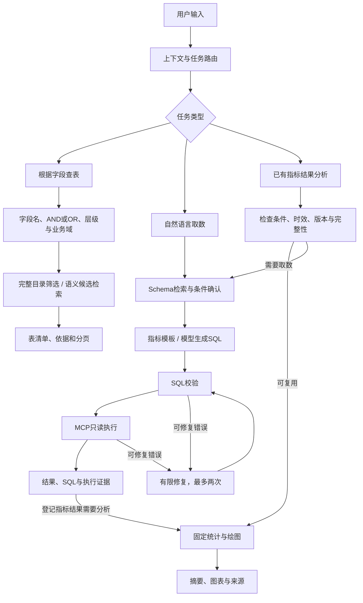
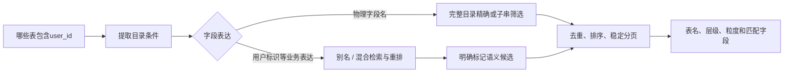
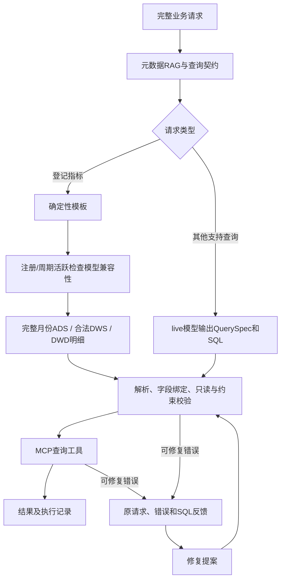
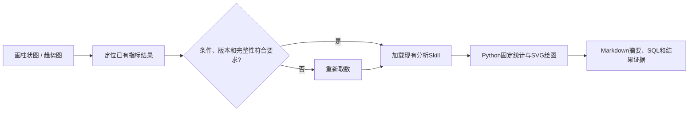

# Data Agent · 数仓问数与元数据查询

独立的 Python 数据 Agent：根据字段找表、自然语言取数、基于已有指标结果进行基础分析。围绕用户增长、渠道投放和内容运营提供 **23 张模拟表、10 条实际加工 SQL**，以指标口径、模型粒度和加工来源约束查询。采用 Python 状态机与原生 Tool Calling，不使用 LangGraph。

当前代码已接入目录查询、通用 SQL 生成与有限纠错、字段画像、加工血缘和注册/周期活跃选表。原有五指标模板、澄清恢复、记忆和基础分析保留。**真实模型未联调**：offline 模式是明确列出的演示规则；live 模式代码通过模拟模型响应测试，不能将这些测试写成模型准确率。详细记录见 [实施状态](docs/IMPLEMENTATION_STATUS.md)。

## 三条执行链路



精确按字段找表不走 Top K 截断；已有结果画图通常不再执行 SQL。通用 SQL 结果使用独立类型并展示表格，不混入原五指标的结果复用、收藏和固定分析函数。

### 1. 根据字段查表



- 输入“哪些表包含 user_id 字段”，可继续“只看 DWD”“还要有 channel_id”“下一页”。
- 精确查询支持同表 AND/OR、字段名子串、层级、业务域；字段名大小写敏感。
- 分页绑定目录版本与查询条件，变更后旧游标失效；完整性仅指当前登记目录。
- 语义检索返回候选而非穷尽列表，不能认为所有同名 `uid` 都表示同一业务实体。
- 输入“ads_channel_growth_month 的上游是什么”，读取真实 ETL SQL 及来源。加工血缘与 Join 关系分开维护。

### 2. 自然语言取数



原有注册、成功激活、注册七日激活率、D7 留存和 CPA 保留模板校验。注册人数接入分层选表；新增周期活跃按请求周期去重，不累加日活计算月活。汇总缺少 OS、日期覆盖不完整或粒度不兼容时，选择明细并保存拒选原因。

通用查询支持 SQLite 只读明细、筛选、聚合、排行、登记关联，以及 CTE、窗口和时间比较表达式。使用 `QuerySpec` 锁定表范围、过滤、分组、投影及排序；修复不修改契约。为了明确验证显式过滤，有 `filters/group_by` 的请求当前要求根单层 SELECT；含复杂 CTE/子查询的过滤语义暂不自动证明。SQL 能执行不代表业务含义一定正确。

SQL 纠错最多两次，遇到重复错误、预算耗尽或禁止操作终止。超时不通过删条件或缩短日期“修复”。静态检查和数据库执行每次都会重新运行；不放开原有指标模板一致性校验。

### 3. 数据分析



现有分析支持行数、非空计数、最小值、最大值、柱状图和趋势图。Skill 提供规则，Python 函数执行计算。未新增自由分析、Python 沙箱、归因或分析工作台。澄清任务可保存后恢复；执行进程异常中断会标记失败，需重新提交，不声称任意断点续跑。

## 技术分工

| 技术 | 作用 |
|---|---|
| Python 状态机＋SQLite 状态库 | 状态迁移、澄清恢复、幂等与执行轨迹 |
| 原生 Tool Calling | live 查询契约、SQL 提案与原有展示决策接口 |
| BM25＋Embedding＋RRF＋CrossEncoder | Schema 双路召回、融合与重排 |
| JSON 元数据＋字段画像 | 类型、含义、别名、单位、粒度、统计分布与版本 |
| SQLGlot | 解析、字段绑定、结构和查询条件检查 |
| MCP stdio | `query_metric`、`query_sql`、`find_tables_by_fields`、`trace_lineage` |
| Skills＋调用预算 | 按执行阶段加载规则、检查工具白名单和调用次数 |
| ETL SQL＋类型化关系 | 区分 Join 与加工血缘，提供选表和来源证据 |

本地检索模型为 `BAAI/bge-small-zh-v1.5` 与 `cross-encoder/mmarco-mMiniLMv2-L12-H384-v1`。fixture 检索仅用于轻量测试，不作为真实向量效果报告。当前固定 `local-demo` 用户，未新增登录或角色权限。

## 运行

```bash
cd '/Users/ruoyangli/Desktop/大模型/Data Agent'
./scripts/start.sh
```

浏览器访问 `http://127.0.0.1:8000`，API 文档在 `/docs`。启动时保留原五表，在同一模拟库事务性新增场景与分层表，并采集完整字段画像；版本未变化时不重复加工。首次本地语义检索可能需要下载模型。

新环境安装：

```bash
python3.11 -m venv .venv
.venv/bin/python -m pip install -r requirements.lock -r requirements-neural.txt
cp .env.example .env
./scripts/start.sh
```

只跑离线轻量测试时，可使用 `AGENT_LOAD_DOTENV=0 RETRIEVAL_BACKEND=fixture RERANK_BACKEND=fixture`；测试不需要模型 Key。

### 可直接演示的输入

| 输入 | 执行分支 |
|---|---|
| 哪些表包含 user_id 字段 | 完整目录筛选 |
| 找 DWD 层同时包含 user_id 和 channel_id 的表 | 多字段与层级过滤 |
| ads_channel_growth_month 的上游是什么 | 加工血缘 |
| 上个月各渠道注册人数 | 登记指标＋分层选表 |
| 再按操作系统拆开 | 原指标流程识别维度变化，重新取数 |
| 上个月各渠道活跃人数 | 周期去重指标＋分层选表 |
| 2026-08-02 至 2026-08-20 各渠道活跃人数 | 拒绝日活直接累加，回退明细 |
| 上个月搜索渠道注册用户明细 | 离线通用查询演示模板 |
| 上个月各渠道注册人数排行前3 | 离线排行模板 |
| 上个月内容播放排行前10 | 内容关联与排行 |
| 上个月各投放计划成本 | 花费与归因注册独立聚合后的成本 |
| 画柱状图 | 仅对已有登记指标结果使用原分析能力 |

离线默认日期为 `2026-09-22`，源数据完整到 `2026-09-20`；ADS 仅包含完整自然月。通过 `AGENT_AS_OF` 调整参考日时仍受实际数据水位限制。offline 通用查询只是上表列出的模板，不是任意自然语言理解；其他请求需配置 live 模型或提供结构化 SQL。

### live 模型配置

沿用 `.env` 配置，不提交真实凭据：

```dotenv
AGENT_MODE=live
MODEL_BASE_URL=https://your-provider.example/compatible-mode/v1
MODEL_NAME=your-tool-calling-model
MODEL_API_KEY=your-key
```

模型接口需支持 `/chat/completions`、原生 `tools/tool_choice`。未配置时明确报错，不伪造生成或修复结果。真实服务效果、准确率和调用成本本轮未验证。

## 数据与元数据维护

`metadata/catalog.json` 是登记目录，包含原五表及新增表的字段、业务说明、关联和模型配置。`warehouse/sql/` 保存 10 条加工 SQL；构建器用固定随机种子生成投放与内容模拟数据，并检查关联键、模型唯一粒度及计划花费对账。

- 增长：ODS 用户/日活快照、DWD 注册/活跃、DWS 日汇总、ADS 完整月增长。
- 投放：计划、计划日花费、唯一注册归因、计划日汇总。约十分之一用户无归因；不根据渠道强行推断计划。
- 内容：创作者、内容、曝光、播放、互动及日汇总。允许重复播放、空观看时长、无播放内容，避免多事实 Join 扇出。
- 字段画像：全量行数、空值率、不同值数、样例、范围和 Top 值分布，带采集时间和版本。只采集本地模拟数据。

```bash
.venv/bin/python -m data_agent.warehouse_build --rebuild
```

重建只替换扩展模块拥有的 18 张表，不修改原五表；事务失败回滚，发现不属于本模块的同名表则拒绝覆盖。元数据或源快照变化后重建并重启应用，使检索索引、内存目录与画像一致。当前使用内容版本驱动的整体刷新，尚非在线增量索引服务。

## API

| 接口 | 用途 |
|---|---|
| `POST /api/ask` | 三类任务聊天入口 |
| `POST /api/metadata/search` | 字段、层级、业务域查询与分页 |
| `GET /api/metadata/profiles` | 已登记表的字段画像 |
| `GET /api/lineage/{table}` | 加工 SQL 及上游来源 |
| `POST /api/query/sql` | `sql`＋`spec` 的只读结构化执行；不调用模型 |

目录查询体：

```json
{"field_terms":["user_id","channel_id"],"field_operator":"all","match_mode":"exact","layer":"DWD","page_size":20}
```

结构化 SQL 查询体：

```json
{
  "sql":"SELECT user_id FROM users WHERE registration_date BETWEEN '2026-08-01' AND '2026-08-31'",
  "spec":{
    "question":"八月注册用户明细",
    "tables":["users"],
    "filters":[{"column":"users.registration_date","operator":"between","values":["2026-08-01","2026-08-31"]}],
    "projections":["users.user_id"],
    "limit":200
  }
}
```

## 验证与边界

```bash
AGENT_LOAD_DOTENV=0 .venv/bin/python -m pytest -q
AGENT_LOAD_DOTENV=0 RETRIEVAL_BACKEND=fixture RERANK_BACKEND=fixture .venv/bin/python evals/run.py
```

测试包括原五指标独立计算对照、目录分页、多轮目录条件、ETL 幂等与画像、周期活跃明细基准、投放/内容对账、只读检查、SQL 条件保持、有限纠错，以及实际 MCP stdio 查询。模型适配测试使用固定响应，不能当作真实模型验证。

原先 6 条本地语义检索记录针对旧五表目录，不能作为扩展 23 表后的效果证明。Docker 配置保留，本次不做容器部署、多用户、记忆升级或分析交互扩展。API 固定本地身份，保持已有访问令牌、表范围、只读和调用预算约束。

开发记录见 [实施状态](docs/IMPLEMENTATION_STATUS.md)，计划与本轮落地边界见 [增强方案](docs/DATA_AGENT_ENHANCEMENT_ROADMAP.md)。
