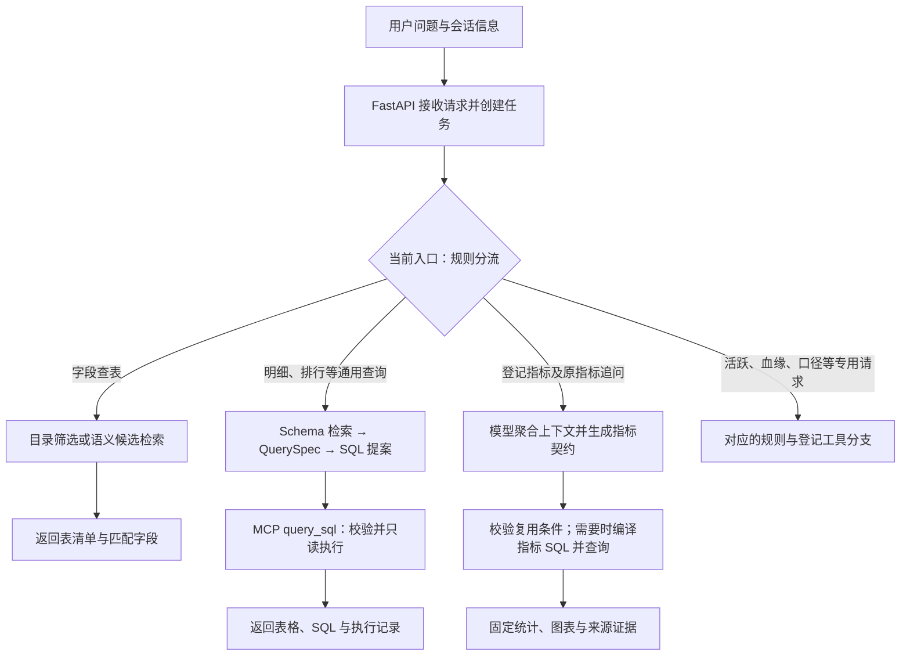
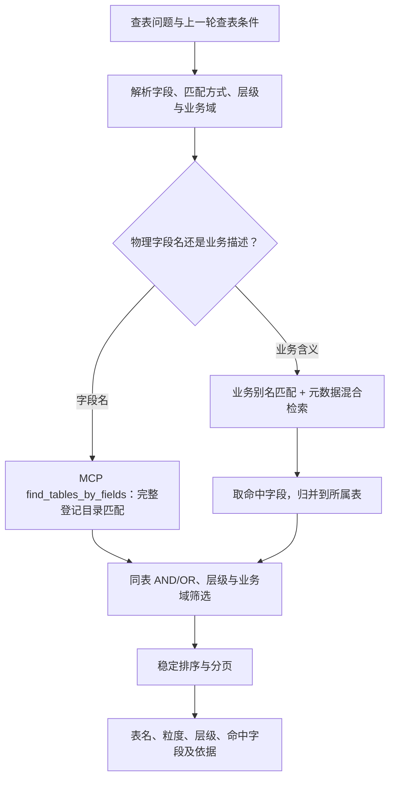
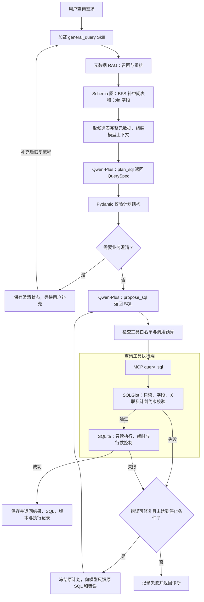

# Data Agent · 数仓元数据检索与智能查数

面向分层数仓的数据 Agent，重点实现两条链路：**根据字段及业务含义找表**，以及**将自然语言需求转成受控查询**。项目使用 Python 状态流程、原生 Function Calling 和 MCP，围绕用户增长、渠道投放、内容运营提供 23 张模拟表及 10 条实际加工 SQL。

**已接入百炼北京地域的 `qwen-plus`，并完成真实模型、本地语义检索和 MCP 查询联调。** 数据来自本地模拟库；已验证的是少量端到端样例，不是生产效果或模型准确率。结果见 [真实联调记录](evals/latest_live_smoke.json)。

## 当前能力与执行入口

| 能力 | 当前实现 |
| --- | --- |
| 字段找表 | 物理字段精确/子串查询；业务别名及语义候选检索；层级、业务域、多字段与分页 |
| 自然语言取数 | 通用查询由模型生成 QuerySpec 和 SQL；登记指标按已定义口径编译 SQL |
| 数仓语义 | 分层模型、粒度、指标依赖、登记 Join 关系、加工血缘；注册与周期活跃支持分层选表 |
| 已有指标结果分析 | 检查复用条件后执行固定统计、柱状图或趋势图；通用 SQL 结果尚未接入同样的分析复用 |

下面是**当前代码**的入口结构。规则首先识别查表、通用 SQL 等专用任务；未进入专用分支的指标请求及追问，再进入模型上下文聚合流程。



统一的**模型意图路由**已加入 [增强规划 E07](docs/DATA_AGENT_ENHANCEMENT_ROADMAP.md)，尚未替换当前入口。不能把上图的规则分流描述为已完成的统一模型分类。

## 链路一：字段与业务含义找表

### 执行流程



- **明确字段名**：例如“哪些表包含 user_id”，精确或子串匹配完整登记目录，不用 Top K 结果冒充全部匹配表。
- **业务描述**：通过字段含义、别名和语义检索寻找候选表，结果标记为候选，不保证语义匹配穷尽。
- **连续查表**：支持“只看 DWD”“还要有 channel_id”“下一页”等条件延续。游标绑定查询条件和目录版本。
- **返回范围**：只查询已登记元数据，不生成业务 SQL，不进行业务指标计算。语义查表在编排进程中调用检索器；精确查表通过 MCP 工具执行。

聊天条件解析目前仍是有限规则。结构化筛选可使用 `/api/metadata/search`，具体以 `MetadataSearchRequest` 为准。

### 两条链路共用的元数据 RAG

```text
metadata/catalog.json
  → 表、字段、指标、Join 关联四类知识块
  → keyword_text / semantic_text / rerank_text
  → BM25 前 24 + 向量前 24
  → RRF 融合取前 24
  → CrossEncoder 重排
  → Schema 图补全与后续处理
```

字段块为三种检索阶段分别组织文本；表、指标和关联块目前三种表示复用原文。三种表示不是三个独立知识块。重排保留数在通用检索中默认 `k=8`，**语义查表显式使用 `k=20`**；数量不足时保留已有候选，补齐关联字段后也可能超过 k。

| 环节 | 实际实现 |
| --- | --- |
| 关键词检索 | Python BM25：分词、TF/DF 和平均长度统计；当前没有倒排索引 |
| 向量检索 | `BAAI/bge-small-zh-v1.5`，本地 CPU 编码并归一化；默认以 NumPy 矩阵计算相似度 |
| RRF 融合 | 按文档编号合并两路候选，累加 `1 / (60 + 名次)`，不混加原始分数 |
| 重排 | `cross-encoder/mmarco-mMiniLMv2-L12-H384-v1`，联合读取问题与候选文本评分 |
| 索引生命周期 | 关键词统计在初始化时建立，文档向量首次检索时生成并在实例内复用；重启后重建 |

当前未设置重排最低分数阈值；相关性排序不等于业务口径验证。Milvus 有可选适配，未进行真实服务联调。语义查表复用同一检索器，也会执行 Schema 图补全；它不传指标契约，因此不触发指标依赖补全。

## 链路二：自然语言取数

### 通用 Text-to-SQL：先计划，再生成，后执行

以下描述 `AGENT_MODE=live` 的通用 SQL 分支。以“查询 2026 年 8 月内容播放次数前 5 名”为例：



图中展示正常路径和 SQL 修复循环；模型请求失败、结构不合法、预算耗尽等异常也会终止当前任务，不会自动放宽校验。澄清后的恢复会重新进入处理流程，不是从任意代码位置续跑。

| 模块 | 输入与产出 | 关键技术 / 代码 |
| --- | --- | --- |
| Skill 加载 | 读取查询规则和工具配置；文本注入 System Prompt，白名单与预算由程序执行 | [skills.py](data_agent/skills.py)、[SQL Skill](skills/sql/SKILL.md) |
| Schema 检索与补全 | 命中的表/字段确定候选表，沿登记 Join 关系补齐连接路径 | RAG、BFS；[schema.py](data_agent/schema.py) |
| 上下文组装 | 根据 Schema 图节点提取候选表的完整元数据 | [extended_engine.py](data_agent/extended_engine.py) |
| 查询计划 | 模型返回表、过滤、输出表达式、分组、排序、limit 和澄清问题 | Function Calling、Pydantic `QuerySpec` |
| SQL 生成 | 模型依据计划、元数据及 Skill 返回 SQL 文本 | Qwen-Plus、`SqlAgent.propose()` |
| 校验执行 | 检查登记表字段、只读、函数与 Join、显式过滤/分组/投影/排序；再执行 | SQLGlot、MCP、SQLite；[sql_agent.py](data_agent/sql_agent.py) |
| 有限纠错 | 保持 QuerySpec 不变，最多追加两次修复；重复 SQL 与错误、违规操作或预算耗尽时停止 | [sql_repair.py](data_agent/sql_repair.py) |
| 结果返回 | 数据、列名、来源 SQL、版本、水位、耗时及截断标记 | 任务持久化与前端表格展示 |

`plan_sql`、`propose_sql` 是模型结构化响应使用的函数名；真正执行查询的 MCP 工具是 `query_sql`。模型本身不连接数据库。

### 当前上下文与校验边界

- Schema 图来自登记 **Join 关系**，不是加工血缘。当前用图选出表，再向模型传入这些表的完整元数据；没有将所有指标块、图边、路径和图约束原文完整注入通用 SQL 提示词。
- `QuerySpec` 也由模型生成。SQL 符合计划，不代表计划正确理解了业务；需要澄清的歧义当前主要由模型判断。
- 有显式 `filters/group_by` 时，校验器要求根单层 SELECT，避免在复杂 CTE/子查询中误判条件。部分无此类约束的 CTE、窗口表达式可通过校验，不承诺任意复杂 SQL 支持或语义等价证明。
- 修复只针对语法、字段绑定、查询约束和 SQL 执行等可修复错误。超时、禁止操作等直接终止，不靠删条件“修复”。每次重试都重新校验并受预算约束。
- 通用 SQL 结果保存在任务中并返回表格，不自动生成自由分析报告，也未接入登记指标的历史结果复用机制。

### 登记指标：理解条件，按口径编译 SQL

注册、成功激活、注册七日激活率、D7 留存、CPA 使用已登记口径。live 模式先由模型聚合上下文、解释请求并生成指标契约，再由程序编译 SQL；并非所有查询都让模型自由写 SQL。

```text
问题与历史上下文
  → 模型聚合请求、生成指标契约
  → 按指标依赖补齐字段与关联，记录检索依据
  → 检查结果是否可复用
  → 需要取数时编译指标 SQL，通过 MCP query_metric 校验并执行
  → 保存指标结果，固定统计或绘图
```

按契约进行的第二次依赖补全会记录在任务中，但这条链路没有再用它请求模型生成自由 SQL。注册指标可进一步选择分层模型；周期活跃是独立规则分支，解析范围后分层选表，通过 `query_sql` 执行。

## 数仓思想如何参与查询

| 设计 | 项目中的作用 |
| --- | --- |
| SOURCE / ODS / DIM / DWD / DWS / ADS | 记录层级、粒度和主键，执行 SQL 构建实际模型 |
| 指标口径与依赖 | 登记过滤、去重、日期规则及必需字段，避免把激活事件数当作激活用户数 |
| 分层选表 | 注册、周期活跃检查日期、维度、粒度及覆盖；合适时使用 ADS/DWS，否则回退 DWD |
| 可加性约束 | 不将日去重活跃人数直接相加为月活；成本等多事实查询先聚合再关联 |
| Join 与加工血缘分离 | Join 描述如何连接；登记血缘描述上游模型及实际加工 SQL |

例如完整自然月各渠道注册人数可使用 ADS；非整月范围可使用日级 DWS；需要按 OS 拆分时，上层缺少维度，回退 DWD。选择器记录候选和拒选原因，使用规则而非实测扫描成本优化。加工血缘可通过工具查询，尚未全面驱动通用 SQL 规划，也不是自动 SQL 字段血缘解析。

## 补充能力：登记指标结果分析

针对“画柱状图”“再按操作系统拆开”等追问，模型结合历史提出查询或分析意图，程序检查指标、维度、过滤、日期、版本、有效期和完整性。可以复用则直接分析，否则重新取数。

分析 Skill 提供规则，模型选择表格、摘要、柱状图或趋势图，Python 固定函数完成行数、非空计数、最小/最大值和 SVG 绘图，报告保留 SQL 与结果来源。现有短期窗口、异步摘要和用户主动保存的记忆保留，但完整复用能力主要在登记指标链路；通用 SQL 不能据此宣称支持任意多轮分析。

## 工具与模型分工

| 组件 | 作用 |
| --- | --- |
| FastAPI + HTML/CSS/JavaScript | 请求入口与本地交互页面，由同一服务提供 |
| Python 执行流程 + SQLite 状态库 | 任务状态、幂等、澄清恢复与轨迹；没有使用 LangGraph |
| `qwen-plus` | 百炼 API；上下文理解、指标契约、通用查询计划、SQL 提案及展示决策 |
| BGE Embedding + mMARCO CrossEncoder | 本地语义召回与重排，独立于 Qwen-Plus |
| SQLGlot + SQLite | SQL 解析和约束检查、只读执行 |
| MCP stdio | 后端与本地工具进程通信；当前每次调用建立进程和会话 |
| Skill 文本与配置 | 任务提示规则、工具白名单与调用预算；不是独立模型 |

| MCP 工具 | 职责 |
| --- | --- |
| `find_tables_by_fields` | 精确/子串字段查表与分页 |
| `query_metric` | 登记指标的受控查询 |
| `query_sql` | 通用 SQL 及程序编译查询的校验执行 |
| `trace_lineage` | 读取登记加工血缘及 SQL 来源 |

MCP 提供工具接口与通信，白名单和预算由编排代码检查，SQL 校验由工具执行端完成。统计绘图目前是本地 Python 函数，不是 MCP 工具。

## 快速运行

### 安装

需要 Python 3.11+。在项目根目录执行：

```bash
python3.11 -m venv .venv
.venv/bin/python -m pip install -r requirements.lock -r requirements-neural.txt
```

首次使用时复制 `.env.example` 为 `.env`；已有 `.env` 则直接编辑，避免覆盖密钥和本地配置。首次语义检索需要下载模型权重。

### 真实模型模式

以下为已联调的百炼北京配置，将密钥填在本地 `.env`：

```dotenv
AGENT_MODE=live
AGENT_TRANSPORT=stdio
MODEL_BASE_URL=https://dashscope.aliyuncs.com/compatible-mode/v1
MODEL_NAME=qwen-plus
MODEL_API_KEY=
MODEL_ENABLE_THINKING=false
RETRIEVAL_BACKEND=local
RERANK_BACKEND=local
LOCAL_EMBEDDING_MODEL=BAAI/bge-small-zh-v1.5
LOCAL_RERANK_MODEL=cross-encoder/mmarco-mMiniLMv2-L12-H384-v1
```

密钥需与接入地域匹配，只保留在忽略的 `.env` 中。先检查配置，再按需验证一次真实调用：

```bash
# 只检查配置项是否齐全，不发起模型请求。
.venv/bin/python scripts/check_model.py
# 实际调用模型，可能产生服务商费用。
.venv/bin/python scripts/check_model.py --live
# 启动本地页面。
./scripts/start.sh
```

打开 `http://127.0.0.1:8000`；API 文档为 `/docs`，`/api/health` 可查看 live/offline、MCP 传输和检索后端配置。修改 `.env` 后重启服务。其他模型需支持当前 `/chat/completions`、指定函数的 `tools/tool_choice` 调用方式，不能仅凭支持聊天就认为兼容。

### 离线演示与样例

`AGENT_MODE=offline` 使用有限规则与模板，不调用规划大模型。通用查询演示覆盖注册明细、渠道注册排行、内容播放排行和投放计划成本，不是任意自然语言理解。本地 Embedding/Rerank 是否启用由各自后端配置决定，与 live/offline 分开。

| 输入 | 路径 |
| --- | --- |
| 哪些表包含 user_id 字段 | 精确目录查询；可追问“只看 DWD”“还要有 channel_id” |
| 哪些表包含用户注册时间相关字段 | 业务含义找表，返回语义候选 |
| ads_channel_growth_month 的上游是什么 | 登记加工血缘 |
| 查询 2026-08-01 至 2026-08-31 内容播放次数排行前 5，返回内容 ID、标题、播放次数；按播放次数降序、内容 ID 升序排序 | live 通用 Text-to-SQL，已真实联调 |
| 2026-08-01 至 2026-08-31 各渠道的成功激活人数 | live 模型理解条件，登记指标 SQL 查询，已真实联调 |
| 基于刚才的结果画柱状图 | 在上一条指标查询的同一会话中，已验证结果复用 |
| 2026-08-02 至 2026-08-20 各渠道活跃人数 | 规则解析的周期去重查询，避免直接累加日活 |

默认参考日期为 `2026-09-22`（live/offline 共用），模拟源数据完整到 `2026-09-20`，ADS 只含完整自然月。修改 `AGENT_AS_OF` 不会自动生成新日期的数据，演示时建议明确给出日期。

## 数据维护与 API

目录定义在 [metadata/catalog.json](metadata/catalog.json)，分层加工在 [warehouse/sql](warehouse/sql)，构建逻辑见 [warehouse_build.py](data_agent/warehouse_build.py)。启动时保留原有 5 张源表，构建或刷新 18 张扩展表；版本不变时跳过重复加工。字段画像包含行数、空值率、不同值数、样例、范围和分布等。

增长场景覆盖分层注册/活跃模型；投放场景包含计划、花费、唯一注册归因；内容场景包含曝光、播放、互动及日汇总。所有数据均为固定种子的本地模拟数据。

```bash
.venv/bin/python -m data_agent.warehouse_build --rebuild
```

重建只替换构建器拥有的扩展表，事务失败回滚；遇到不属于本模块的同名表会拒绝覆盖。修改元数据或源快照后重建并重启应用，保持目录、画像和检索索引一致。当前没有在线增量索引服务。

| 接口 | 用途 |
| --- | --- |
| `POST /api/ask` | 聊天入口，创建任务并执行 |
| `POST /api/tasks/{task_id}/resume` | 用户补充信息后恢复澄清任务 |
| `POST /api/metadata/search` | 结构化字段、层级、业务域筛选与分页 |
| `GET /api/metadata/profiles` | 字段画像 |
| `GET /api/lineage/{table}` | 登记加工 SQL 和上游来源 |
| `POST /api/query/sql` | 接收 `sql` + `spec` 后校验执行，本接口不生成 SQL |

字段查表请求示例：

```json
{
  "field_terms": ["user_id", "channel_id"],
  "field_operator": "all",
  "match_mode": "exact",
  "layer": "DWD",
  "page_size": 20
}
```

结构化 SQL 请求示例：

```json
{
  "sql": "SELECT user_id FROM users WHERE registration_date BETWEEN '2026-08-01' AND '2026-08-31'",
  "spec": {
    "question": "八月注册用户明细",
    "tables": ["users"],
    "filters": [{"column": "users.registration_date", "operator": "between", "values": ["2026-08-01", "2026-08-31"]}],
    "projections": ["users.user_id"],
    "limit": 200
  }
}
```

## 验证记录与后续工作

### 真实联调：2026-09-27

使用百炼 `qwen-plus`、本地 Embedding/Rerank、真实 MCP stdio 和模拟 SQLite 数据。查表样例本身不需要调用 Qwen，其余样例实际调用了模型。

| 样例 | 已记录的结果 |
| --- | --- |
| DWD 层同时包含 user_id、channel_id 的表 | 返回 2 张表 |
| 内容播放次数前 5 | 模型生成 SQL，5 行结果与独立参考 SQL 一致 |
| 各渠道成功激活人数 | 返回 4 个渠道，与独立计算结果一致 |
| 追问柱状图 | 成功复用登记指标结果并生成图表 |

见 [完整样例记录](evals/latest_live_smoke.json)。联调发现并由开发修复了 SQL 显示别名导致的校验误判；这不是模型自动纠错成功样例。相关 21 项软件测试在该次修复后通过，记录不代表本次 README 更新重新运行了业务测试。

### 软件测试

```bash
AGENT_LOAD_DOTENV=0 .venv/bin/python -m pytest -q
AGENT_LOAD_DOTENV=0 RETRIEVAL_BACKEND=fixture RERANK_BACKEND=fixture .venv/bin/python evals/run.py
```

软件测试覆盖目录分页、ETL、独立数据对账、查询约束、有限纠错、状态与实际 MCP 通信；模型适配测试使用模拟响应，fixture 检索不代表真实语义模型效果。旧 6 条检索样例基于旧目录，不能作为当前 23 表目录的效果评测。

已规划：统一模型意图路由，详见 [增强规划 E07](docs/DATA_AGENT_ENHANCEMENT_ROADMAP.md)。真实模型澄清/摘要、成功纠错与复杂问题泛化仍缺少联调证据；通用 SQL 上下文尚未完整纳入图约束，通用结果也尚未接入指标分析复用。这些是当前边界，不表示已安排全部扩展开发。

当前为单机、固定本地身份的演示项目；保留访问令牌和执行端约束，不宣称企业多租户、行列权限、任意 Python 沙箱或通用自动归因。已保存澄清任务可恢复，执行进程意外中断的任务会标记失败，需重新提交。Docker 配置保留，尚未完成容器运行验证。

实现记录与历史检查点见 [实施状态](docs/IMPLEMENTATION_STATUS.md)。
